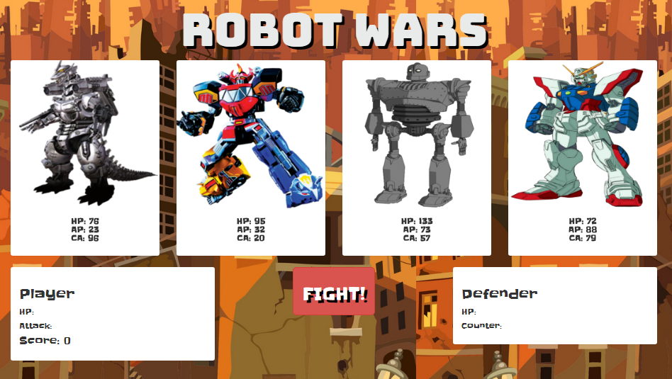

# RPG-Game

https://allenjwelch.github.io/RPG-Game/

Select a player from the top screen then choose defender to fight against. 
Click the 'Fight!' button to attack 
Each attack will receive a counter attack from defender unless the defender is defeated. 
Your player will grow stronger with each attack. 

Updates Needed:
- Still needs Winning screen
- Change Alert message to something more...

Key concepts learned from this exercise:
- moving elements (.append()) vs. creating elements (.html())in the DOM
- this

